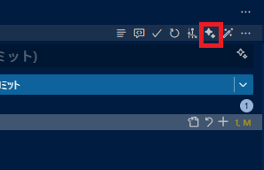

[English README](README.md)

主な対象は VS Code 互換エディタです。特に Cursor、Kiro、VSCodium、Antigravity を想定しています。

# コミットメッセージジェネレーター (by GitHub Copilot)

この拡張は、リポジトリの変更から Conventional Commits 形式のコミットメッセージを自動生成して、ソース管理の入力欄へ挿入します。  
GitHub Copilot SDK を使って GitHub Copilot から応答を取得します。

## 使い方

- UI から（推奨）
  - ソース管理ビューのタイトルバーとコミット入力欄の近くにボタンが追加されます。クリックで「Commit message generation by GitHub Copilot」を実行します。
  - Git プロバイダーが有効な場合に表示されます。  
  
  - 生成中はステータスバーに「$(sync~spin) Generating commit message...」が表示され、完了時に自動で消えます。  
  
- コマンドパレットから
  - `Ctrl+Shift+P` → 「Commit message generation by GitHub Copilot」と入力
  - あるいは「Commit message generation by GitHub Copilot」(`commit-message-gene-by-ghcopilot.runCopilotCmd`) を直接実行
  - 完了すると、生成メッセージはコミット入力欄に挿入されます。実行ログは出力パネル「commit message gene by ghcopilot」で確認できます。

## 設定

- `commitMessageGeneByGhcopilot.prompt.intro.en`
- `commitMessageGeneByGhcopilot.prompt.intro.ja`

## 要件

- Windows 10/11 + VS Code の Git 拡張が有効であること
- ソース管理ビュー（SCM）を開いていること
- GitHub Copilot サブスクリプション、または SDK で利用できる対応済みの GitHub Copilot 認証方法にログインしておくことを推奨します
- VS Code の GitHub Copilot か GitHub Copilot CLI のどちらかは、事前にインストールしてログインしておく必要があります。普段から使っている状態だとスムーズです

## メモ

- プライバシー: 拡張自体はコードを外部送信しませんが、GitHub Copilot は設定によりリポジトリの文脈を GitHub へ送信する場合があります。GitHub Copilot のポリシーをご確認ください。

## ライセンス

MIT License © 2025-2026 komiyamma
